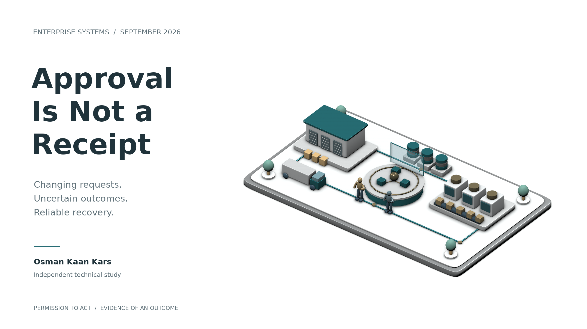
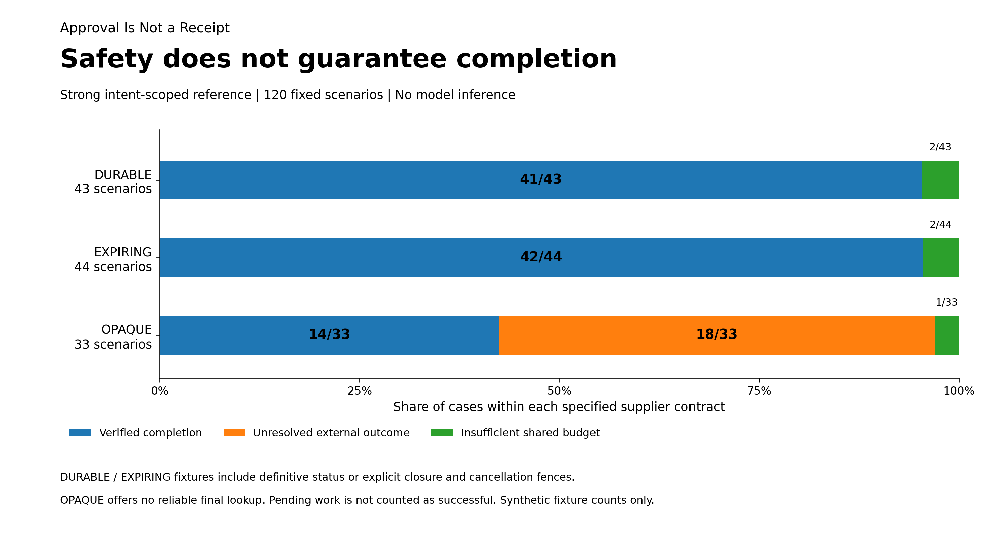
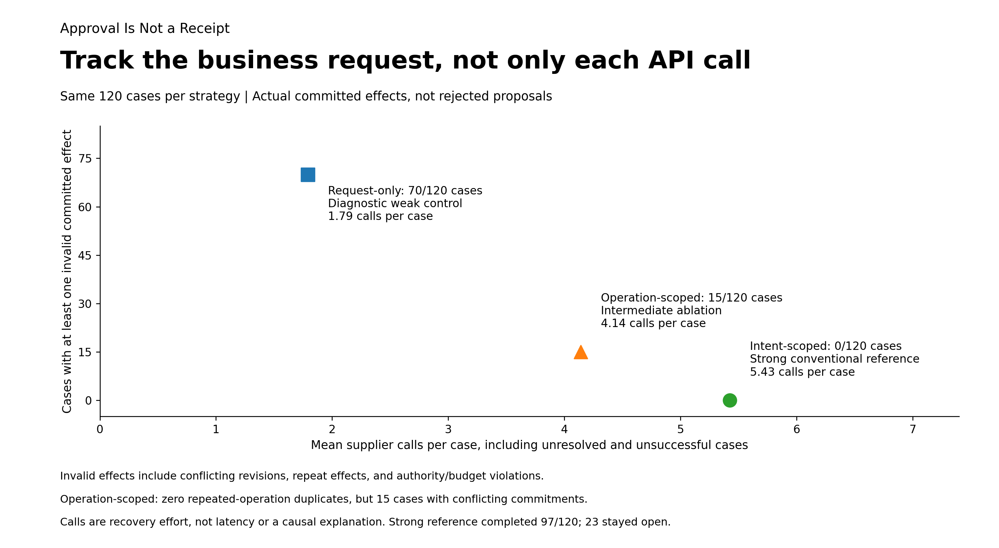

# Approval Is Not a Receipt

*What changing purchase requests reveal about safe retries, supplier guarantees and accountable AI workflows.*

**Osman Kaan Kars | 19 September 2026**

A supplier accepts an order for 100 units. Its response never reaches the buyer. The requirement then changes to 60 units from another supplier.

In one of the controlled tests accompanying this article, an executor created the replacement without resolving the original order. Both operation identifiers were unique. Neither API operation was repeated. Yet the business was left with 160 units of active commitment against a requirement of 60.

That is the distinction I wanted to examine: protecting an API call from duplication is not necessarily the same as protecting the business request behind it.

Fast agent architectures make this a timely engineering question. WindTunnel's September 2026 Jev and Mercury 2.5 implementation separates action selection from argument generation. Our study does not run those models or measure their speed. Instead, it examines the execution layer such a decision-making system would depend on: what happens when the previous action may already have changed the world? [1]

## The missing fact is not another instruction

An approval answers whether an operation may proceed. A receipt provides evidence of what happened. A timeout provides neither confirmation of success nor proof that nothing happened.

These are established distributed-systems concerns. AWS's guidance discusses caller-supplied identifiers, late requests and changed parameters. CAV-Bench already distinguishes successful final states from valid execution histories. Provenact studies stateful authorization and identifies external effects and reconciliation as a separate challenge. None of these principles originated in this study. [2, 3, 4]

The narrower contribution here is an inspectable comparison of **request revision during an unresolved external effect**, across explicit supplier guarantees. Rather than inventing a new coordinator, I tested how much a conventional, well-scoped workflow can establish, and where it must stop.

A revised requirement cannot erase a possibly existing order. Someone may authorize a different purchase, but the system still has to account for the earlier commitment.

## Three scopes, the same purchase problem

The experiment uses two controlled suppliers with separate, durable SQLite ledgers. There are 120 fixed synthetic cases across 12 families, including lost responses, delayed lookup, expired retry protection, client restart, changing quantities, cancellation uncertainty and competing budget reservations. Each case runs once under three deterministic executors. No human participants, language-model inference or production ERP systems are involved. [6]

**Request-only execution** is a deliberately weak diagnostic control. **Operation-scoped execution** adds durable operation identity, current dispatch checks, budget reservations and status reconciliation. **Intent-scoped execution**, the strong conventional reference, also tracks every operation belonging to the same business request across revisions and suppliers.

The important comparison is the last two. The intermediate version is not presented as the best existing method. Its omission of cross-revision coordination is explicit, so the experiment isolates what that capability contributes.

Provider assumptions matter just as much. Some fixtures support durable retry protection and definitive status. Others have expiring keys but retain separate, explicit closure evidence. A third group cannot reliably confirm the original result. An empty lookup is never silently promoted into proof of absence. Stripe's documented key-retention behavior illustrates why retry guarantees need a time boundary, although our supplier contracts are not a reproduction of Stripe. [5, 6]

## Zero repeated operations, fifteen conflicting commitments

Across the 120 cases, operation-scoped execution completed **83** correctly and produced **no repeated-operation duplicate effects**. Nevertheless, **15 cases contained conflicting commitments across revisions**, and 20 ended with an unsupported completion claim. Those categories overlap; they must not be added together. [6]

The intent-scoped reference completed **97**, with no observed invalid committed effects or unsupported success claims. It left **18 cases unresolved** because supplier evidence was insufficient, and **five blocked by the shared budget**. These are finite fixture counts, not deployment success probabilities. [6]

*Figure 1. The strong reference avoids invalid effects in this suite without claiming every task is complete. Closure and cancellation fences are explicit fixture guarantees, not assumed features of real suppliers.*

Return to the 100-to-60 example. The strong executor first obtained evidence of the original acceptance, then confirmed its authorized cancellation, then placed the replacement. The old 100-unit purchase was valid when dispatched. The failure to avoid was creating a conflicting replacement while that commitment remained open, not retrospectively declaring the original approval invalid.

The result does not show a new algorithm outperforming established practice. It shows established practice working when its scope includes the whole request, and how a narrower implementation can fail despite correct per-operation retry handling.

## Reliable recovery has a cost, and sometimes a limit

The strong reference made **651 supplier calls**, compared with **497** for operation-scoped execution, across the same 120 cases. That is 154 additional calls, including status queries, retries and cancellation requests. It is not a latency comparison, and the polling strategy was not optimized for minimum traffic. [6]

*Figure 2. Recovery effort includes unsuccessful and unresolved cases. More calls are not themselves the cause of correctness; the executor's obligations and behavior change together.*

The most useful boundary appeared in a separate diagnostic. Two otherwise matched runs exposed exactly the same observations after a 100-to-60 revision. One had accepted the original 100 units; the other had accepted nothing. Their visible histories were byte-for-byte identical, while their durable ledgers differed. The strong executor stayed unresolved in both and retained the same possible liability. [6]

This is not a new impossibility theorem. It is a concrete test of a basic information limit: the client cannot distinguish those outcomes until the provider supplies distinguishing evidence. More confident reasoning cannot substitute for that evidence.

A decision-maker can accept the commercial risk of an additional purchase. That is different from the software silently assuming the first order disappeared. The authorization should make that extra exposure explicit.

## What this changes in an ERP discussion

I would ask a supplier-integration team more than whether an endpoint supports an idempotency key. How long is the key retained? Does a status response establish a final outcome? Can an old request still arrive after an absence response? Does cancellation confirmation prevent later recreation? Which liability remains reserved during uncertainty?

Those questions make safe automation conditional on an inspectable contract, rather than on a model's apparent competence. In our stronger fixtures, definitive absence and cancellation install a provider-side fence: a durable block on later creation of the same operation. That is a substantial guarantee. A generic acknowledgement from a real service must not be treated as equivalent.

To check that the experiment was not merely replaying labels, 26 cases were also executed through actual loopback HTTP supplier processes. Connections were closed before acceptance or after durable acceptance, and separate integration tests abruptly terminated and restarted clients. All **78 case/executor outcomes** in the HTTP subset matched the corresponding direct results. The code also passed **69 software and integration tests**. [6]

These checks establish implementation consistency, not production reliability. The cases are public, synthetic and finite. The HTTP subset overlaps the main evaluation. Some weaker methods never reached every injected compound stage; the accompanying coverage audit records that rather than crediting unexercised failures as successful recovery. CAV-Bench's runtime was not reproduced, and this is not a head-to-head claim against it.

For me, the practical contribution is a testable distinction between **permission to act, evidence of an effect and permission to replace it**. It gives engineers a concrete way to inspect that distinction before handing more work to an autonomous system.

Human responsibility belongs in setting priorities, authorizing changed exposure and resolving exceptions that require business knowledge. It should not be reduced to guessing whether a missing response means an order failed.

**Approval permits an action. A receipt supports a claim about its outcome. Reliable delegation keeps both attached to the same business request, even when the request changes.**

---

## Sources and research materials

[1] WindTunnel. [Jev + Mercury 2.5 implementation notes](https://github.com/nekuda-ai/WindTunnel/blob/5ca8644e23826ebb30108e7bad240b61043bfe67/experiments/jev/README.md). September 2026. External architecture context; no model results from that project are presented as our measurements.

[2] Malcolm Featonby. [Making retries safe with idempotent APIs](https://aws.amazon.com/builders-library/making-retries-safe-with-idempotent-APIs/). Amazon Builders' Library.

[3] Nixalkumar Patel. [CAV-Bench methodology](https://github.com/Harimay23/cav-bench/blob/0e818a00517384241357b08354596ed7462872bf/docs/methodology.md). Pinned source reviewed; upstream benchmark not reproduced here.

[4] Yuxiang Peng and Xiaodi Wu. [Stateful Governance for Concurrent Agentic Systems](https://arxiv.org/html/2608.02764v1). arXiv:2608.02764v1, August 2026.

[5] Stripe. [Idempotent requests](https://docs.stripe.com/api/idempotent_requests). Accessed 19 September 2026. Our mock contracts do not imply a guarantee by Stripe.

[6] Companion study, 19 September 2026. [Methods](METHODS.md), [primary results](results/eval-direct/summary.csv), [ledger audit](results/audit/verification.json) and [reproduction instructions](README.md). 120 synthetic cases; no human participants, model inference or live ERP integration.

*Independent educational research. All business inputs were synthetic. No employer or customer data or production ERP connections were used.*
