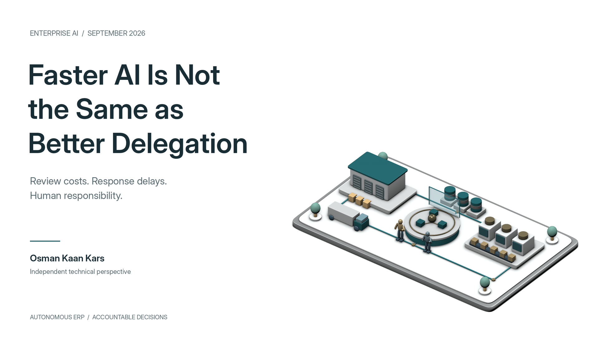
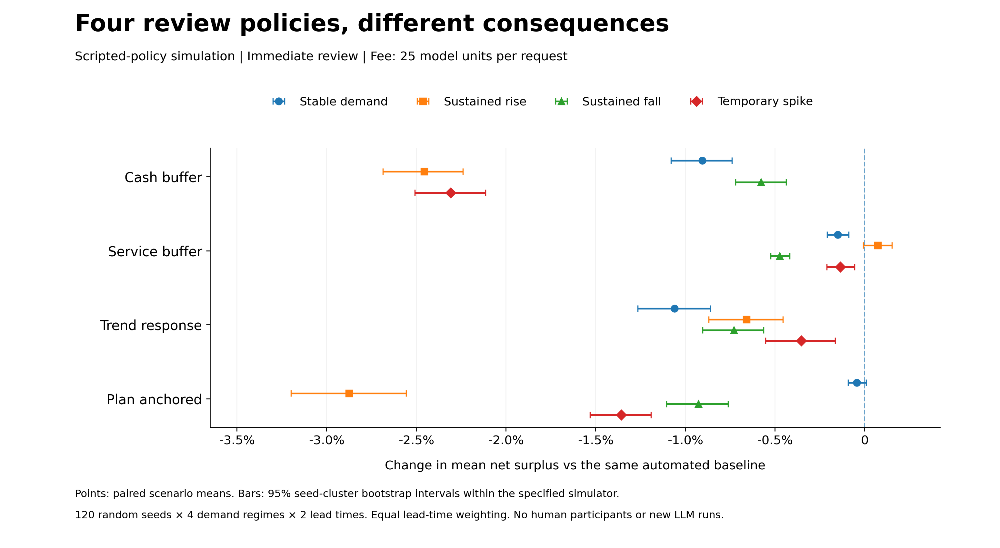
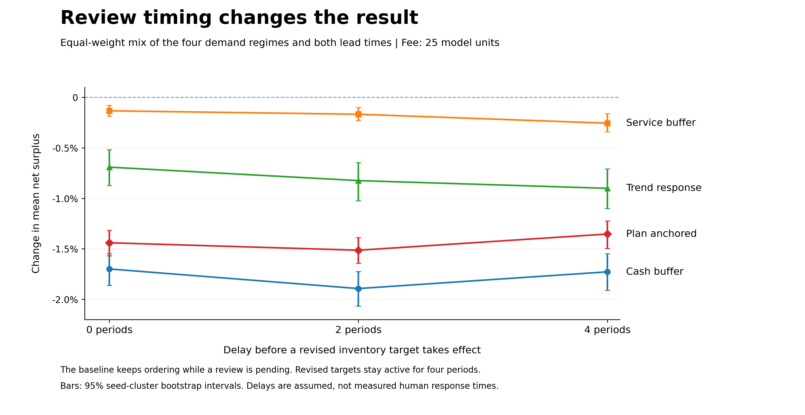

# Faster AI Is Not the Same as Better Delegation

*What review costs and response delays reveal about using autonomous ERP well.*

**Osman Kaan Kars · 19 September 2026**

Imagine a purchasing agent finding a better price and requesting approval for a larger order. The proposal is reasonable when it is submitted. By the time approval arrives, demand has changed and another team has already committed part of the available cash. The question is no longer whether the original calculation was correct. It is whether the decision still makes sense.

That question deserves more attention as agents become faster. This month, TypeSafe introduced Jev, a model designed to return structured decisions rather than free-form text. Browser Use's Jev Ultrafast example separates operation selection from text generation; its documented configuration uses Mercury 2.5 for the latter. These developments are useful context, not systems tested in the experiment below. [1, 2]

The opportunity for ERP is substantial: less time coordinating routine work, more attention to decisions that need context. SAP's Autonomous Enterprise vision explicitly keeps people responsible for priorities and constraints while agents carry out defined work. Better delegation is consistent with that vision, not an argument against it. [3]

## An approval step needs a purpose

“Keep a human in the loop” leaves several questions unanswered. What information can the reviewer add? What can they change? What continues while they decide?

To examine a small part of this problem, I used a transparent inventory simulation. It compares one replenishment controller with four scripted review policies that temporarily change its stock target. **There are no human participants or new language-model runs.** This is a test of decision rules, not a measurement of human judgment or an ERP product benchmark. [4]

The baseline adapts to the previous 12 demand observations. The four alternatives remove its safety-stock allowance, increase that allowance, react to the latest three observations, or return to the initial plan. They receive the same available history and obey the same cash and order limits.

The experiment spans steady demand, a sustained rise, a sustained fall and a temporary spike, with supply lead times of one and four periods. There are 960 scenario settings, built from 120 random seeds. The demand paths are synthetic and included with the code; they are not observations of September business activity.

Each run permits at most four review requests. A revised target lasts four periods. Response delays are zero, two or four periods, and the assumed fee is zero, 25 or 100 model units per request. The baseline keeps ordering while a review is pending. [4]

## Better service can be worth a small cost

With immediate responses and a fee of 25, all four policies reduced average net surplus across the equally weighted scenario mix. The changes were **-1.70% for cash buffer, -0.13% for service buffer, -0.69% for trend response and -1.44% for plan anchored**. [4]

*Figure 1. Each policy is compared with the same automated baseline. Bars are 95% seed-cluster bootstrap intervals under the specified demand generator. Immediate response; fee: 25 model units. These are simulation results, not human-performance estimates.*

Net surplus accounts for acquisition, inventory-holding and review costs, plus a stated credit for stock remaining at the end. It is not real-world ROI. The assumed costs and terminal stock value matter to the result.

A single economic score also misses a business choice. Service buffer increased the average fulfilled share of demand by approximately **0.25 percentage points**, while reducing net surplus by 0.13%. A company might accept that exchange to protect customer commitments. Our model does not price every consequence of failing to serve a customer. [4]

Nor is the lesson that review is pointless. The baseline already adapts, and the four interventions bring no external information. They alter how the same history is used. An expert who knows that a promotion has ended or a customer has cancelled a contract is contributing something this experiment does not contain.

The practical distinction is between **changing a calculation and adding useful judgment**. An additional step can do the first without doing the second.

## A late decision is a different decision

For the trend-response policy, the average surplus change moved from **-0.69% with immediate application to -0.90% after four periods**. But delay was not uniformly worse: some interventions became less harmful when applied later. Faster execution is not automatically better execution. [4]

*Figure 2. The same policies and demand paths, with different response delays. Fee: 25 model units; equal weighting across demand regimes and lead times. Intervals reflect simulation uncertainty, not measured human response times.*

These periods cannot be converted into milliseconds or used to estimate the benefit of a faster language model. The connection to current agent technology is a design question: what should happen between proposing a decision and executing it?

I would give a proposal a validity condition, not just an approval status. Which changes in stock, price, available cash or customer commitments should invalidate it? Can routine work continue safely while it waits? Who may revise the objective rather than merely approve the old recommendation?

The simulator rechecks current inventory and resource limits before ordering. It does not test every possible expiry rule. That broader recommendation is an interpretation of the timing problem, not another measured result.

## Put expertise where it changes the outcome

There is relevant human evidence, but it belongs to another study. Baek and colleagues report a 2026 classroom experiment with 69 participants and three inventory instances. In their setting, people making final decisions after receiving algorithmic and LLM recommendations outperformed a mode in which AI acted with periodic human guidance. The result supports designing the collaboration carefully; it does not establish the best arrangement for every ERP process. [5]

It also challenges an easy assumption: people should not necessarily be moved out of individual decisions and left only with high-level oversight. Sometimes the individual decision is where their knowledge matters.

For an ERP programme, I would keep three questions separate: **Is the action permitted? Is it operationally sensible? Does it still serve the business objective?** Automation can answer more of the first two without inheriting the authority to settle the third.

A reviewer needs relevant information, time to interpret it and real authority to change the outcome. An approval queue alone provides none of those guarantees. Equally, removing the reviewer does not remove the trade-off; it leaves the system to apply the preference already embedded in its instructions.

The useful goal is not maximum autonomy or maximum approval. It is a clear division of work: automate repeatable decisions within understood limits, evaluate exceptions against a matched baseline, and keep people able to change the priorities those decisions serve.

**Faster agents create room for better delegation. The value comes from deciding what they should do, when a decision has expired, and who remains responsible for changing direction.**

---
## Sources and research materials

[1] [Diogo Almeida. Introducing System One Models and Jev. TypeSafe, September 2026. Vendor announcement; not tested in this study.](https://typesafe.ai/blog/introducing-system-one-models-and-jev)

[2] [Browser Use. Jev Ultrafast, README, accessed 19 September 2026. Architecture and configuration context; not independently benchmarked here.](https://github.com/browser-use/jev-ultrafast/blob/main/README.md)

[3] [Eric van Rossum and Manoj Swaminathan. The Autonomous Enterprise: Better Decisions in Motion. SAP, 27 May 2026.](https://news.sap.com/2026/05/autonomous-enterprise-better-decisions-in-motion/)

[4] Companion computational study, 19 September 2026. Methods, fixed scenario specification, generated demand paths, code and numerical results accompany this article. Zero human participants; zero new LLM calls. [Methods](METHODS.md) · [Results](results/article_results.csv) · [Reproduce](README.md).

[5] [Jackie Baek, Yaopeng Fu, Will Ma and Tianyi Peng. AI Agents for Inventory Control: Human-LLM-OR Complementarity. arXiv:2602.12631v1, 13 February 2026. External classroom study, not participant data collected here.](https://arxiv.org/html/2602.12631v1)

*Independent educational study. No employer or customer data or live ERP connections were used. Synthetic demand and scripted policies do not establish human-review returns.*
